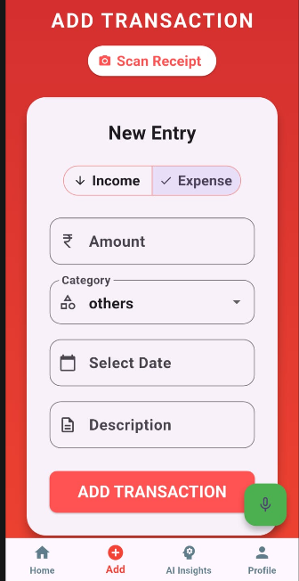
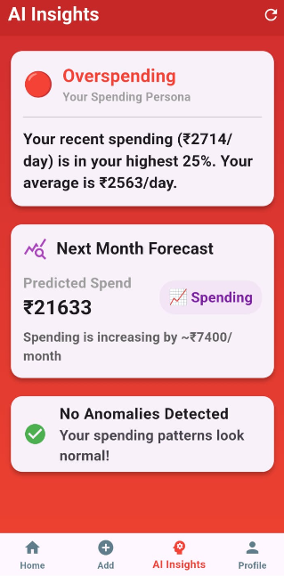
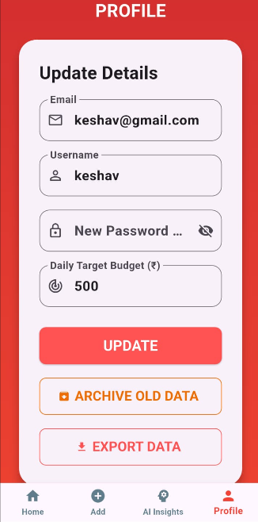

# Smart Expense Tracker

A 100% offline, privacy-first personal finance manager built with Flutter. Smart Expense Tracker moves away from bloated, cloud-dependent financial apps by storing all your sensitive data locally on your device using SQLite. It acts as an active financial assistant by providing intelligent spending insights, OCR receipt scanning, and speech-to-text data entry—all without requiring an internet connection.

##  Features

*   **100% Offline Architecture:** Complete data sovereignty. All transactions, profiles, and settings are stored locally on your device via SQLite. No cloud accounts, no data leaks.
*   **Intelligent OCR Receipt Scanning:** Uses Google ML Kit to scan physical receipts. A custom rule-based engine uses Regex to automatically extract the merchant name, date, and total amount (with fallbacks for messy receipts).
*   **Speech-to-Text Entry:** Too lazy to type? Hold the mic button and say *"I spent 500 on pizza"*. The app automatically extracts the amount and categorizes it as 'Food'.
*   **AI Insights Engine:** 
    *   **Spending Persona:** Analyzes your recent spending against historical percentiles to assign you a persona (e.g., Ultra Saver, Overspending).
    *   **Anomaly Detection:** Calculates the standard deviation for your categories and flags any transaction that is > 2 standard deviations above your mean.
    *   **Forecasting:** Uses Simple Linear Regression (Least Squares Method) to predict your exact spending for the next month.
*   **CSV Data Export:** Easily export your entire database to a CSV file and share it via your native share sheet (WhatsApp, Google Drive, etc.) for manual backups.

---

## 📸 Screenshots

*(Note: Ensure your screenshot images are placed in a folder named `screenshots` in the root of your repository to display correctly here).*

  
  
  
  

---

##  Technical Stack

*   **Framework:** Flutter (Dart)
*   **Local Database:** `sqflite` (SQLite)
*   **Machine Learning:** `google_mlkit_text_recognition` (On-device OCR)
*   **Voice Recognition:** `speech_to_text`
*   **Data Export:** `csv`, `path_provider`, `share_plus`

